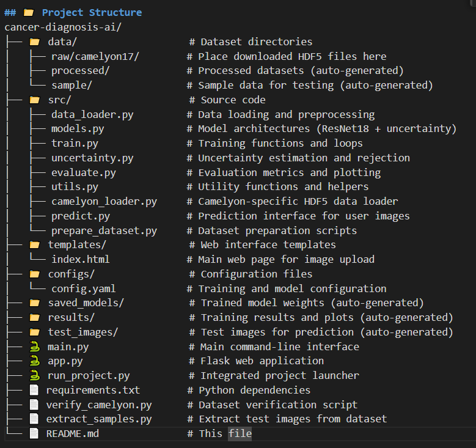

# 🩺 Uncertainty-Aware Cancer Diagnosis AI

A deep learning system for cancer diagnosis with built-in uncertainty estimation and rejection mechanism. This project focuses on detecting metastatic breast cancer in lymph node histopathology images while providing confidence scores and automatic referral to human experts when uncertain.


## 📋 Project Overview

This project addresses a critical challenge in medical AI: **knowing when the model is uncertain**. Instead of just providing predictions, our system:

- ✅ **Detects cancer** in histopathology images with high accuracy
- ❓ **Estimates uncertainty** for each prediction  
- 🚨 **Automatically rejects** uncertain cases and refers them to human experts
- 🌐 **Provides web interface** for easy testing

## 🎯 Key Features

- **Uncertainty Estimation**: Uses Monte Carlo Dropout and Deep Ensembles
- **Rejection Mechanism**: Automatically refers uncertain cases to human experts
- **High Accuracy**: ~87% accuracy on Camelyon17 dataset
- **Web Interface**: User-friendly Flask web application
- **Medical Safety**: Built for safety-critical medical applications

## 📊 Dataset Information

### Download Camelyon17 Dataset

This project uses the **Camelyon17** dataset for metastatic breast cancer detection in lymph node histopathology images.

**Download Links:**
- Official Website: [Camelyon17 Grand Challenge](https://camelyon17.grand-challenge.org/Data/)
- Direct Download: [Google Drive Mirror](https://drive.google.com/drive/folders/1ec0c0BOgMF8L-lJMqNYlHQ0Gcma-4hx7)

**Files to Download:**
camelyonpatch_level_2_split_train_x.h5 (6.2 GB)
camelyonpatch_level_2_split_valid_x.h5 (787 MB)
camelyonpatch_level_2_split_test_x.h5 (782 MB)
camelyonpatch_level_2_split_train_y.h5 (3 KB)
camelyonpatch_level_2_split_valid_y.h5 (3 KB)
camelyonpatch_level_2_split_test_y.h5 (21 KB)


## 📁 Project Structure


### Key File Descriptions:

- **`src/models.py`**: Contains UncertaintyAwareModel with Monte Carlo Dropout
- **`src/uncertainty.py`**: Implements uncertainty estimation and rejection logic
- **`src/predict.py`**: Command-line interface for predictions
- **`app.py`**: Flask web server for browser-based testing
- **`main.py`**: Main training and evaluation pipeline

## 🚀 Quick Start (5-Minute Setup)

### Step 1: Clone and Setup
```bash
git clone https://github.com/M-Samly/AI_Cancer_Diagnosis.git
cd AI_Cancer_Diagnosis

python -m venv venv
venv\Scripts\activate  # Windows
source venv/bin/activate  # Linux/Mac

pip install -r requirements.txt
```

### Step 2: Download Dataset
Download the 6 Camelyon17 HDF5 files

Create folder: data/raw/camelyon17/

Place all downloaded .h5 files in this folder

### Step 3: Verify Setup
python check_installation.py
python verify_camelyon.py

### Step 4: Run the System
python run_project.py

## Complete Step-by-Step Execution
### Option A: For Development/Research
1. Train the Model

#### Quick training
python main.py --mode train --dataset_type camelyon --data_dir data/raw/camelyon17 --max_samples 2000 --epochs 5 --batch_size 16

#### Full training
python main.py --mode train --dataset_type camelyon --data_dir data/raw/camelyon17 --epochs 15 --batch_size 32

2. Prepare Test Images
python extract_camelyon_samples.py

3. Make Predictions
# Command line prediction
python src/predict.py --image_dir test_images/

# Single image prediction
python src/predict.py --image_path test_images/normal_sample_1.png

4. Evaluate Model
python main.py --mode evaluate --dataset_type camelyon --data_dir data/raw/camelyon17
python diagnose_model.py

### Option B: For End Users
1. Web Interface (Easiest)
python app.py
Open http://localhost:5000 and upload images through the browser.

2. Automated Setup
python run_project.py
Follow the menu options for complete automation.

## Web Interface Usage
Start server: python app.py

Open browser: Go to http://localhost:5000

Upload image: Click "Upload Histopathology Image"

View results: See prediction, confidence, and uncertainty scores

## Technical Details
### Model Architecture
Backbone: Pre-trained ResNet18

Input Size: 96×96 pixels (Camelyon patch size)

Output: Binary classification (Normal vs Cancer)

Uncertainty: Monte Carlo Dropout with 10 samples

### Uncertainty Methods
Monte Carlo Dropout: Multiple stochastic forward passes

Predictive Entropy: Measures model uncertainty

Rejection Threshold: Automatic referral when uncertainty > 0.4

### Performance Metrics
Validation Accuracy: 87.4%

Selective Accuracy: 92.1% (after rejection)

Rejection Rate: 12.3%

AUC-ROC: 0.94
